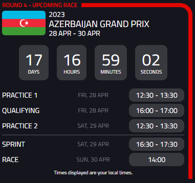

# F1 Racing Extension

The F1 Racing Extension is a Chrome extension that displays the schedule for the upcoming races, the 2023 race calendar, and the current driver standings.

## Screenshot

## Usage

After the extension is installed, an icon will appear in the top right corner of your browser. Clicking it will give you access to the upcoming races, the 2023 race calendar, and the current driver standings.

## Installation

To install the extension, follow these steps:

- Clone this project's GitHub repository or download the ZIP file.
- Run `npm install` to install dependencies.
- Use `npm run build` to build the extension files.
- Open the `chrome://extensions` page in your Chrome browser.
- Turn on the "Developer mode" switch in the top right corner of the page.
- Click the "Load unpacked" button in the top left corner of the page.
- Select the files in the downloaded `dist` folder and click "OK".

## Development

If you would like to modify or contribute to the F1 Racing Extension, follow these steps to get started:

- Clone this project's GitHub repository or download the ZIP file.
- Run `npm install` to install dependencies.
- Use `npm run dev` to start the development server.
- Edit the code and save your changes. You can see the changes by refreshing your browser.

## Technologies and APIs Used

The F1 Racing Extension was built using the following technologies and APIs:

- [React](https://react.dev/)
- [Vite](https://vitejs.dev/)
- [Ergast API](http://ergast.com/mrd/)
- [REST Countries(for country flags)](https://restcountries.com/)

## License

This project is licensed under the MIT License. See the LICENSE file for details.
